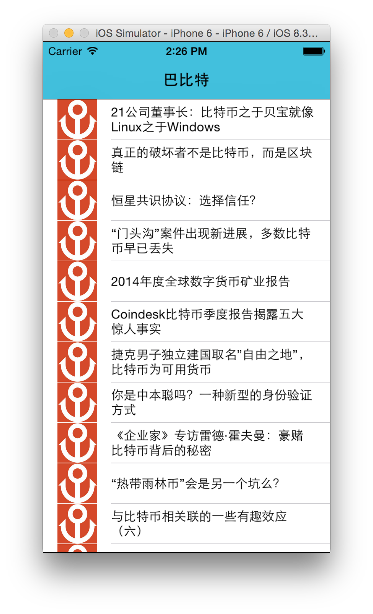

Swift RSS Sample
================

An RSS reader app written in [Swift](https://developer.apple.com/swift/). About 100 lines of code and written within about an hour. Proved Swift is a good programming language :-)




change in 2015.4.20
1. upgrade code to work in new swift version
2. update to 8btc RSS.

### Installation

Using [CocoaPods](http://cocoapods.org). 

```sh
pod install
```

### LICENSE

This software is released under the MIT License, see LICENSE.